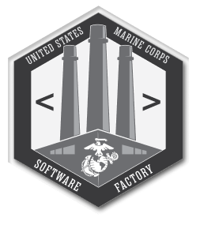

<div id="top"></div>

<!-- PROJECT LOGO -->
<br />
<div align="center">
  <a href="https://github.com/Patrick-Sherlund/mcswf">



  </a>

<h2 align="center">U.S. Marine Corps Software Factory</h2>

  <p align="center">
    An informational static site for Marines to gather information about the U.S. Marine Corps Software Factory and apply to join the team.
    <br />
    <a href="https://github.com/Patrick-Sherlund/mcswf"><strong>Explore the docs »</strong></a>
    <br />
    <br />
  </p>
</div>

<!-- TABLE OF CONTENTS -->
<details>
  <summary style="font-size: 23px; border:.01rem solid #a9a9a9; max-width: fit-content; padding: 0 1rem; border-radius: 5px">
Table of Contents
</summary>
  <ol>
    <li>
      <a href="#about-the-project">About The Project</a>
      <ul>
        <li><a href="#built-with">Built With</a></li>
      </ul>
    </li>
    <li>
      <a href="#getting-started">Getting Started</a>
      <ul>
        <li><a href="#prerequisites">Prerequisites</a></li>
        <li><a href="#installation">Installation</a></li>
      </ul>
    </li>
    <li>
      <a href="#building--deploying-website">Building & Deploying Website</a>
      <ul>
        <li><a href="#prerequisites">Prerequisites</a></li>
        <li><a href="#steps">Steps</a></li>
      </ul>
    </li>
    <li>
      <a href="#app-folder-structure">App Folder Structure</a>
      <ul>
        <li><a href="#app">App</a></li>
        <li><a href="#components">Components</a></li>
        <li><a href="#global">Global</a></li>
        <li><a href="#models">Models</a></li>
        <li><a href="#modules">Modules</a></li>
        <li><a href="#utils">Utils</a></li>
      </ul>
    </li>
    <li><a href="#important-links">Important Links</a></li>
    <li><a href="#roadmap">Roadmap</a></li>
    <li><a href="#license">License</a></li>
    <li><a href="#contact">Contact</a></li>
    <li><a href="#acknowledgments">Acknowledgments</a></li>
  </ol>
</details>


<!-- ABOUT THE PROJECT -->

## About The Project

The U.S. Marine Corps Software Factory is a static informational site built in the React Framework.
<br/>
The goal of the website is to disseminate information about the Software Factory to the Fleet Marine Force
<br>
and provide an opportunity for Marines to apply to our team.

<p align="right">(<a href="#top">back to top</a>)</p>

### Built With

* [React.js (Typescript Template)](https://reactjs.org/)

<p align="right">(<a href="#top">back to top</a>)</p>


<!-- GETTING STARTED -->

## Getting Started

We recommend having a good Integrated Development Environment installed on your machine... Some examples are:
<br/>

* [Visual Studio Code (Free)](https://code.visualstudio.com/)
* [JetBrains WebStorm (Free 30-Day Trial)](https://www.jetbrains.com/webstorm/download/#section=windows)
* [JetBrains IntelliJ Idea (Free)](https://www.jetbrains.com/idea/download/#section=windows)
* [xCode (MacOS) (Free)](https://developer.apple.com/xcode/)

### Prerequisites

Download the Current or LTS version of Node.JS and Git

* Node.JS
  ```sh
  https://nodejs.org/en/download/current/
  ```
* Git
  ```sh
  https://git-scm.com/downloads
  ```

### Installation

1. Clone the repo
   ```sh
   git clone https://github.com/Patrick-Sherlund/mcswf.git
   ```
2. Install NPM packages
   ```sh
   npm install
   ```

<p align="right">(<a href="#top">back to top</a>)</p>

## Building & Deploying Website

### Prerequisites

1. Clone the mcswf static site repo
   ```sh
   git clone https://github.com/Patrick-Sherlund/mcswf.github.io.git
   ```
2. Validate the public URL in the <b>.env</b> at the root direcetory
    * _This is required because when the application is compiled into js, the public url variable is used when
      referencing all assets._

   </br>_<b>.env PUBLIC_URL</b>_
   ```sh
   PUBLIC_URL=https://patrick-sherlund.github.io/mcswf.github.io
   ```

### Steps

1. From the mcswf repository (This repository, not the static site repo) build the React application
   ```sh
   npm run build
   ```
2. Copy the contents from the mcswf -> build folder and overwrite the content of the mcswf.github.io repository
   ```sh
   Copy the contents of the 'build' folder -> paste contents into mcswf.github.io repository and overwrite
   ```
3. From the 'mcswf.github.io' repository add, commit and push the changes
   ```sh
   git add -A
   git commit -m "COMMIT MESSAGE"
   git push
   ```
4. View changes at the [Marine Corps Software Factory Static Site](https://patrick-sherlund.github.io/mcswf.github.io/)

## App Folder Structure
_The folder structure logically separates different areas of the application, to help organize development._
    
```
mcswf
├── src
│   ├── app
│   │   ├── components
│   │   ├── global
│   │   │   ├── enums
│   │   │   ├── types
│   │   ├── models
│   │   │   ├── classes
│   │   │   ├── interfaces
│   │   ├── modules
│   │   ├── utils
└   └── assets
```
* ### 'app' 
    ```
    This section encapsolates the 'components', 'models', 'modules' and 'utils'. 
    It also serves as the root director for app.tsx
  ```
* ### 'components' 
    ```
    This section contains all reusable components, all components within this section are built with reusability in mind.
  ```

* ### 'global'
    ```
    This section contains any type of global declaration, we use this for enums and types.
  ```
* ### 'models' 
    ```
    This section contains any type of object model, whether its an Interface or a Class.
  ```
* ### 'modules' 
    ```
    This section contains all of the pages the app uses, for example 'Home', 'About', 'Contact' etc.
  ```
* ### 'utils' 
    ```
    This section contains any utility function that could be reused across different components.
  ```


## Important Links

* [Agile Board <b>(Pivotal Tracker)</b>](https://www.pivotaltracker.com/n/projects/2575870)
* [Figma Design](https://www.figma.com/file/26FduvNae6jlmGjJie37AL/Marine-Corps-Software-Factory?node-id=0%3A1)
* [Jenkins Pipeline <b>(Dev)</b>](#)
* [Jenkins Pipeline <b>(Stage)</b>](#)
* [Jenkins Pipeline <b>(Prod)</b>](#)
* [AWS S3 Bucket <b>(Dev)</b>](#)
* [AWS S3 Bucket <b>(Stage)</b>](#)
* [AWS S3 Bucket <b>(Prod)</b>](#)

_To request access to Pivotal Tracker or Figma, please contact Patrick Sherlund
at [patrick.sherlund@usmc.mil](mailto:patrick.sherlund@usmc.mil)_
<br/>
_For issues with any other services, please submit a ticket with MCBOSS via
the [MCBOSS Support Desk](https://jira.adts.usmc.mil/servicedesk/customer/user/login?destination=portals)_

<p align="right">(<a href="#top">back to top</a>)</p>


<!-- ROADMAP -->

## Roadmap

- [ ] Desktop Design
    - [ ] Light Theme
    - [ ] Dark Theme
- [ ] Mobile Design
    - [ ] Light Theme
    - [ ] Dark Theme
- [ ] Tablet Design
    - [ ] Light Theme
    - [ ] Dark Theme

_To view a full list of stories in the backlog, please
visit [Pivotal Tracker](https://www.pivotaltracker.com/n/projects/2575870)_

See the [open issues](https://github.com/Patrick-Sherlund/mcswf/issues) for a full list of proposed features (and known
issues).
<p align="right">(<a href="#top">back to top</a>)</p>

<!-- LICENSE -->

## License

Distributed under the MIT License. See `LICENSE.txt` for more information.

<p align="right">(<a href="#top">back to top</a>)</p>


<!-- CONTACT -->

## Contact

* Email: [patrick.sherlund@usmc.mil](mailto:patrick.sherlund@usmc.mil)
* Project Link: [https://github.com/Patrick-Sherlund/mcswf](https://github.com/Patrick-Sherlund/mcswf)

<p align="right">(<a href="#top">back to top</a>)</p>

<!-- ACKNOWLEDGMENTS -->

## Acknowledgments

* [N/A]()

<p align="right">(<a href="#top">back to top</a>)</p>
